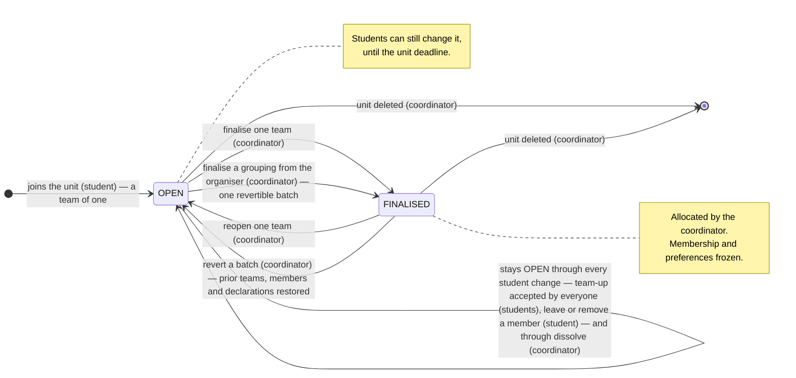
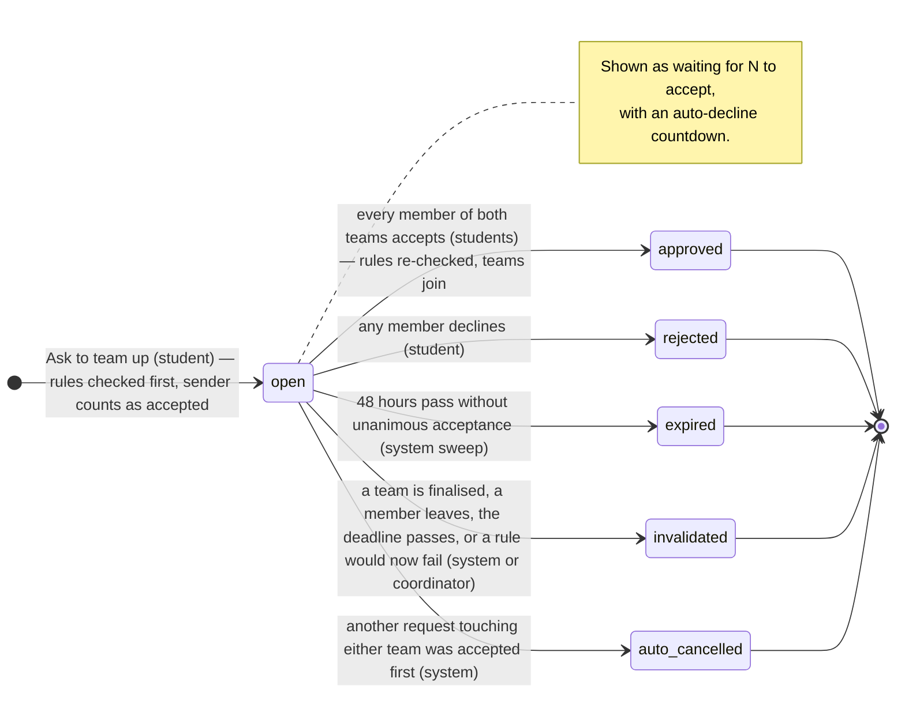

# TeamUp Web – Team Formation Platform

A web app that helps university teaching staff form student project teams and lets
students find teammates, set preferences, and self-organise into groups that satisfy
the unit's team-formation rules.

Built with **Node.js + Express** and a file-based **SQLite** database (via
[`sql.js`](https://sql.js.org/)). The frontend is plain HTML/CSS/vanilla JS — no
build step and no frontend framework.

## Requirements

- Node.js 18+ (developed on v22)
- npm

No database server or other external service is needed — the database is a single
`teamup.db` file created automatically on first run.

## Setup & Run

```bash
# 1. Install dependencies (one time)
npm install

# 2. Start the server
npm start          # or: npm run dev   (auto-restart via nodemon)

# 3. Open in your browser
http://localhost:3000
```

The server listens on `PORT` (default `3000`).

### Tests

```bash
npm test
```

Runs the `node:test` suites in `test/` against a throwaway database in the OS temp
directory — never against `teamup.db`. Node 21+ is needed for the glob in the
script; on older Node run `node --test test/teamValidator.test.js` etc. directly.

## Upgrading from an older clone

**Read this before pulling if you cloned before `921353e`.** `teamup.db` used to be committed. It no
longer is — it holds real accounts and password hashes, so it is now git-ignored. The commit that
removes it will also delete **your** local database and your `node_modules`, so back the database up
first or you lose everything you have added.

Git protects you on the first attempt. Because your `teamup.db` is tracked *and* modified, `git pull`
stops with:

```
error: Your local changes to the following files would be overwritten by merge:
        teamup.db
Please commit your changes or stash them before you merge.
```

Do **not** reach for `git stash` or `git reset --hard` here — both discard your data. Do this instead:

```bash
# 1. Back up your database OUTSIDE the repo folder
cp teamup.db ../teamup-backup.db          # Windows: copy teamup.db ..\teamup-backup.db

# 2. Let git delete the tracked copy cleanly
git checkout -- teamup.db

# 3. Pull (only stash first if you have your own *code* edits)
git pull

# 4. Reinstall dependencies — node_modules is no longer tracked
npm install

# 5. Put your database back; it is git-ignored now, so it stays yours
cp ../teamup-backup.db teamup.db          # Windows: copy ..\teamup-backup.db teamup.db

# 6. Run
npm start
```

Your data survives the upgrade. `SchemaMigrator` runs on every start, creates the new tables and
columns in place, and backfills the new per-unit roster from existing enrolments, so your students
keep access. On first start you should see:

```
Loaded existing teamup.db
Roster backfill: N existing enrolments granted access
```

If it says `Created new teamup.db` instead, step 5 did not happen — the app is running on an empty
database and your backup is still sitting outside the repo.

**Already pulled and lost the file?** The last *committed* version is still in history (your newest
changes since that commit are not):

```bash
git checkout c6a09d2 -- teamup.db
git rm --cached teamup.db     # required — the line above re-stages it for commit
```

**One edge case.** The roster backfill matches on email, so an enrolled student whose account has no
email address gets no roster entry and will not see that unit. Re-add them from
**Class List → Who Can Join**.

From here on `teamup.db` is ignored, so it will never conflict on a pull again and everyone keeps
their own local data.

## Roles & Portals

Open `http://localhost:3000` to reach the portal-select page. From there you sign in
(or sign up) as a **Teacher** or a **Student**. Passwords are hashed with SHA-256.

### Teacher portal
- **Create a unit** – name, semester, deadline, and the minimum / maximum team
  size. Two rules apply to every unit and are not configurable: a student may be
  in at most one group, and every group must share a tutorial.
- **Import a class list** – bulk-import students from a parsed CSV when creating a unit.
- **Progress dashboard** – per-unit aggregate counts across the student journey
  (read rules → entered preferences → grouped / declared / no activity → finalised).
- **Class list** – every enrolled student with their progress stages, placement
  category and saved preferences.
- **All teams** – every team in the unit with live **validation** (size against the
  target, shared tutorial, new-to-university limit) and the coordinator's overrides:
  **finalise**, **reopen**, **dissolve**. Nothing waits on approval — groups record
  themselves (see *How a group is recorded*).
- **Organiser** – after the deadline, an auto-match suggestion the coordinator can
  edit and **finalise** as one revertible batch.

### Student portal
- **Account** – sign up / log in. The student number is captured at signup for the
  coordinator's opt-in export only; it is never shown to any student, including its owner.
- **Browse & join units** – see available units and join one.
- **Read the rules** for a unit and track progress through each stage.
- **Set preferences** – tutorial slots, project interests, skills, preferred role
  (saved per unit).
- **Find teammates** – search classmates by **name** (tolerant of misspellings and partial
  input) or by a **full connect email you already have**; filter by tutorial, interest, or
  skill. A classmate's email is shown only when two results share a name.
- **Team up** – ask a classmate (or their group) to team up; everyone on both sides
  accepts or declines. Unanimous acceptance joins the two teams — that is the record.
  Leave or remove members until the deadline.
- **My team** – view members and live rule validation for your team; declare
  *"place me anywhere"* if you are on your own with no preferred teammates.

## Project structure

The backend follows a layered, object-oriented design wired by dependency
injection. `server.js` is the **composition root**: it constructs one `Database`,
the repositories, and the services, then injects them into the route factories.
Each layer depends only on abstractions handed to it, which keeps units testable
in isolation and makes adding a new entity a matter of subclassing
`BaseRepository` + adding a service.

```
teamup-web/
├── server.js                 Composition root — builds the object graph, injects, mounts routers
├── db/
│   ├── Database.js           class Database — sql.js connection + all/get/run/tx/save
│   └── SchemaMigrator.js     class SchemaMigrator — DDL + one-shot data migrations
├── teamup.db                 SQLite database file (created/updated at runtime)
├── repositories/             Data-access layer (classes, raw SQL)
│   ├── BaseRepository.js     base class holding the injected Database
│   ├── userRepository.js     class UserRepository extends BaseRepository
│   └── studentRepository.js  class StudentRepository extends BaseRepository
├── services/                 Business logic (classes, constructor injection)
│   ├── authService.js        class AuthService — SHA-256 hashing, login/signup
│   ├── studentService.js     class StudentService — student profile lookup
│   └── teamRequestService.js class TeamRequestService — team-up requests, rules checked at send and accept
├── routes/                   Express REST API (router factories: deps → router)
│   ├── auth.js               login / signup / logout / me
│   ├── units.js              teacher: units, class lists, progress, team reviews
│   └── student.js            student: join units, preferences, teams, team-up requests
├── middleware/auth.js        Session guards (requireAuth / requireStudent / requireTeacher)
├── utils/                    Helpers (uuid, team-size parsing, team validation)
└── public/                   Frontend (static HTML / CSS / vanilla JS)
    ├── index.html            Portal select
    ├── login.html, signup.html   Shared auth pages
    ├── student/              Student portal pages (home, dashboard, my-team, …)
    ├── teacher/              Teacher portal pages (home, dashboard, class-list, …)
    └── assets/
        ├── css/              style1.css, teacher-style.css, style.css
        ├── js/               api.js (fetch/table/modal helpers), student-nav.js
        └── img/              icons
```

## Database

SQLite, stored as a single `teamup.db` file in the project root. The schema is
created automatically by `db/SchemaMigrator.js` on startup (idempotent
`CREATE TABLE IF NOT EXISTS` plus a few additive `ALTER TABLE` migrations). Key tables:

| Table | Purpose |
|-------|---------|
| `users` | accounts (username, password hash, email, role, `student_id` — the n-number, stored for the export option only) |
| `students` | student profile (display name, major, tutorial availability, units passed) |
| `units` | a unit/class and its team-formation rules |
| `unit_roster` | who may join a unit, keyed by email (the teacher's class list) |
| `unit_students` | who has actually joined; carries the roster attributes and the student's "place me anywhere" declaration (`no_preference_at`) |
| `student_progress` | per-student stage tracking within a unit |
| `student_unit_prefs` | per-student preferences within a unit |
| `unit_teams` / `unit_team_members` | unit-scoped teams and membership |
| `proposals` / `proposal_votes` | team-up requests and each member's accept/decline (legacy table names) |
| `finalise_batches` | one row per organiser save, with a snapshot so the batch can be reverted |

### How a group is recorded

There is no submit step and no teacher approval. A student asks another team to
**team up**; every member of both teams **accepts** or **declines**. The moment
everyone has accepted, the two teams become one — that is the record of mutual
preference. The unit's hard rules are evaluated twice on the way: when the request
is sent (an infeasible team-up is refused with `400 RULE`, naming the rule and why)
and again just before the teams are joined (preferences may have moved). A
preference change that would put a recorded group in breach is refused too
(`400 PREFS_WOULD_BREAK_GROUP`).

The unit's **deadline** is the only thing that freezes students: after it, sending,
accepting, leaving and removing all return `403 DEADLINE_PASSED` server-side.

### How teams move

<!-- Source: docs/state-diagrams.md — keep the two blocks below in sync with it. -->

A team is **OPEN** (its students can still change it, until the unit's deadline) or
**FINALISED** (the coordinator has allocated it; membership and preferences are
frozen). Only the coordinator moves a team between the two. Full definitions and
notes: [docs/state-diagrams.md](docs/state-diagrams.md).



The flow a student actually experiences is the **team-up request**: one side asks,
every member of both teams accepts or declines, and unanimous acceptance joins the
two teams. (Stored under the older `proposals.state` names.)



### Team size is a target, not a gate

The teacher enters a minimum and maximum team size; the browser expands that to the
list `units.valid_team_sizes` stores (e.g. `4,5` — see `public/assets/js/team-sizes.js`).
It is the size the coordinator is aiming for in the final allocation and does **not**
stop a smaller group forming: a pair or trio who want to work together is a valid,
incomplete record. What the server does refuse are the hard rules — no shared tutorial
slot, or more members than the largest allowed size. See `utils/teamValidator.js`.

A student who is alone can declare *"I have no preferred teammates — place me
anywhere"* (`POST /api/student/units/:unitId/no-preference`). Every student then falls
into one of three **placement** categories (`utils/placement.js`): `GROUPED`,
`DECLARED`, `SILENT`. The class list, the export and the teacher's attention
notifications all use these.

### Team status: OPEN / FINALISED

A team is `OPEN` (students can still change it) or `FINALISED` (the coordinator has
allocated it; frozen). Only the coordinator writes `FINALISED`, by exception: per team
(finalise / reopen / dissolve) or from the organiser, where every save is a batch with
a snapshot and can be reverted as a unit. Databases from the approval era are
migrated on boot (`FORMING`,`SUBMITTED` → `OPEN`; `APPROVED` → `FINALISED`) and every
group of 2+ is re-validated; groups that break a rule are reported in the log.

A recorded group can still be put in breach later by a rule edit, a tutorial-slot
delete or a roster re-import. The rules modal previews which groups a change would
break before it is saved (`GET /api/units/:unitId/rules/impact`), the students see
the breach on My Team with the rule named, and the organiser dissolves such groups
(reporting why) rather than treating them as protected.

Auto-match (`services/matchingService.js`) is a suggestion tool: it never splits a
feasible OPEN group. It does not balance tutorial load across teams.

### Identifiers: who can see what

Students cannot see anyone's student number (n-number) in QUT systems, so the app
never shows one to a student — not a classmate's, not their own — and never puts one
in a payload a student can read. The number is captured at signup and stored
(`users.student_id`, `unit_roster.student_number`) for exactly one reader: the export's
opt-in column (`UserRepository.listStudentNumbers`, called only from `buildExport`).
The teacher class list and roster views identify students by name and email.

**Classmate search** (`GET /api/student/units/:unitId/students?search=`) matches names
tolerantly (`utils/studentSearch.js`: partial tokens, order-free, small edit distance)
and emails **exactly on the full address** — never on a prefix or fragment, so an
address cannot be fished for. What comes back is governed server-side:

- a classmate's email is attached to a row **only when two or more results share the
  same normalised name** — the one case where the name cannot tell them apart;
- a row found by its email comes back *without* the email (the searcher typed it;
  echoing it would confirm a guess);
- every other row carries no email.

The endpoint is rate-limited per student per unit (30 queries / 5 minutes → `429
SEARCH_RATE_LIMITED`, one warn line per rejection naming the user and unit, never the
query). Any sane session is a handful of queries; a burst is someone walking the
address space.

The export (`GET /api/units/:unitId/export`) identifies every student by **email** —
the address on the teacher's roster, which is the join key against the class list.

### Open decisions

These are deliberately not settled by the code. Each is on record here so a
deployment makes the call consciously rather than by default.

1. **Student number in the export.** Off by default (`units.export_student_number`).
   Whether the n-number may leave the system depends on whether TeamUp is hosted
   inside QUT.
2. **Directory email visibility.** Students are never shown the cohort's addresses
   as a list. Whether they may be depends on the same hosting question and on how
   much contact between strangers the unit wants to enable.
3. **The shared-name disclosure.** As implemented, when two enrolled students share a
   name, anyone who searches that name sees **both full connect addresses** — that is
   how they are told apart. The narrower alternative is to show only a masked local
   part (e.g. `a.ch••@connect.qut.edu.au`), which still separates most pairs but is not
   a usable address. Implemented as full-address; the choice is recorded, not implied.
4. **The search rate limiter is in-memory and per-process.** It resets on restart and
   is not shared across instances — fine for the single-process sql.js deployment this
   app is. Running TeamUp multi-instance needs a shared store (Redis, or a table).
5. **The email daily cap is 10.** Enough for a busy day of team-up traffic;
   deliberately low so a 400-student unit cannot generate thousands of sends
   from one teacher action. Raise it in `services/notificationService.js` if
   real usage shows students hitting it.

## API Reference

All `/api/*` endpoints return JSON. Student/teacher routes require an authenticated
session of the matching role.

### Auth — `/api/auth`
| Method | Endpoint | Auth | Description |
|--------|----------|------|-------------|
| GET  | `/me`     | Any | Current session user |
| POST | `/login`  | —   | Log in (`username`, `password`, `role`) |
| POST | `/signup` | —   | Create account |
| POST | `/logout` | Any | Destroy session |

### Units (teacher) — `/api/units`
| Method | Endpoint | Description |
|--------|----------|-------------|
| GET  | `/` | List the teacher's units |
| POST | `/` | Create a unit and import students |
| GET  | `/:unitId` | Single unit |
| PUT  | `/:unitId/rules` | Update team-formation rules |
| GET  | `/:unitId/progress` | Aggregate progress counts |
| PUT  | `/:unitId/progress/:studentId` | Update a student's stage |
| GET  | `/:unitId/class-list` | Class list with per-student progress + prefs |
| GET  | `/:unitId/all-teams` | All teams with validation |
| PUT  | `/:unitId/teams/:teamId/override` | Coordinator override: `finalise` / `reopen` / `dissolve` |
| GET  | `/:unitId/finalise-batches` | Organiser saves, newest first |
| POST | `/:unitId/finalise-batches/:batchId/revert` | Put a batch back exactly as it was |
| GET  | `/:unitId/rules/impact` | Which groups a proposed rules change would break (read-only) |
| GET  | `/:unitId/export` | The coordinator's report as rows: teams, ungrouped students by category, summary |
| GET  | `/:unitId/suggestions` | Auto-match suggestion (after the deadline) |
| POST | `/:unitId/finalise-teams` | Finalise a grouping as one revertible batch (after the deadline) |
| GET  | `/student/enrolled` | (student) Units the caller is enrolled in |

### Student portal — `/api/student`
| Method | Endpoint | Description |
|--------|----------|-------------|
| GET  | `/units` | All units, flagged with whether the caller has joined |
| POST | `/units/:unitId/join` | Join a unit |
| GET  | `/units/:unitId` | Unit details (must be enrolled) |
| GET/PUT | `/units/:unitId/progress` | Get / update own progress |
| GET/POST | `/units/:unitId/prefs` | Get / save preferences |
| GET  | `/units/:unitId/students` | Search/filter classmates |
| GET  | `/units/:unitId/my-team` | Own team + validation |
| POST/DELETE | `/units/:unitId/no-preference` | Declare / withdraw "place me anywhere" (solo students) |
| DELETE | `/units/:unitId/teams/:teamId/members/:studentId` | Remove a member |
| POST | `/units/:unitId/team-requests` | Ask another team to team up (rules checked, `400 RULE` if infeasible) |
| GET  | `/units/:unitId/team-requests` | List requests the caller is part of |
| PATCH | `/units/:unitId/team-requests/:id/respond` | `{ response: 'accept' \| 'decline' }` |

## Email notifications

Students get a **Notifications** tab with an unread badge, covering team-up
requests, deadline reminders and team status changes.
Email is a delivery channel for those same events — same rows, same dedupe keys
— dispatched by the background pass once a minute.

### What is emailed, and the defaults

Per student, per unit, three switches (`student_email_prefs`; the Notifications
page has the toggles, and every email ends with a one-click unsubscribe for its
own category that needs no login):

| Category | Events | Default |
| --- | --- | --- |
| Team-up requests | received · accepted · declined · **about to expire (24 h)** · no longer valid · withdrawn | **on** |
| Your team | finalised / reopened by the coordinator | **on** |
| Deadline reminders | a week / 3 days / a day away / passed | off |

Never emailed: a request that *expired* (the 24 h warning already went out;
nothing is left to do) and internal rows. A *withdrawn* request (another
team-up completed first) is emailed only to students who were **not** also in
the winning request — they got that one's "accepted" instead. That rule is
keyed on `proposals.superseded_by`, never on timestamps.

The account-level switch (`notification_prefs.email_enabled`) and minimum
severity still apply on top. `APP_BASE_URL` builds the links in the body.

### Volume bounds

- **One email per event per student**, guaranteed by `notifications.emailed_at`,
  which is stamped *before* the transport is called. A crash mid-send leaves a
  visible failed/queued row in `email_outbox`, never a duplicate. The stamp is
  in the database file, so it survives restarts.
- **10 emails per student per rolling day** (`EMAIL_DAILY_CAP`). Anything past
  it is dropped with a reason in the outbox and one warn line naming the user —
  not deferred, because a "request received" email a day late is worse than
  none, and the in-app inbox still has it.
- The two default-off categories are the ones that fan out to a whole class.

Configure with a `.env` file in the project root (copy `.env.example`). `.env` is
git-ignored; real environment variables override it.

| Transport | `MAIL_TRANSPORT` | What it does |
| --- | --- | --- |
| Console | `console` *(default)* | Records to `email_outbox` and the log. **Nothing is sent.** |
| Ethereal | `ethereal` | Real SMTP to a disposable test inbox. No credentials. Each message gets a preview URL, stored in `email_outbox.preview_url`. |
| SMTP | `smtp` | Real delivery via `SMTP_HOST`, `SMTP_PORT`, `SMTP_USER`, `SMTP_PASS`, `MAIL_FROM`. |

### Before switching on real delivery

> **`MAIL_TRANSPORT=smtp` sends real email to every address in the `users` table.**
> Seed and demo accounts have live third-party addresses, and email cannot be recalled.

Two guards, both applied to every transport:

```bash
MAIL_REDIRECT_TO=you@example.com   # ALL mail goes here; the real recipient is
                                   # kept in email_outbox.intended_recipient
                                   # and named in the message body
MAIL_ALLOWLIST=you@example.com,@qut.edu.au   # only these may receive mail;
                                             # anything else is recorded skipped
```

`MAIL_REDIRECT_TO` takes precedence over `MAIL_ALLOWLIST`. On startup the server
prints which transport is active and whether mail is being redirected.

**Gmail:** enable 2-Step Verification, then create a 16-character App Password
(Google Account → Security → 2-Step Verification → App passwords); a normal
account password is rejected. Use `SMTP_HOST=smtp.gmail.com` with `SMTP_PORT=465`.

Every dispatch decision — sent, skipped or failed, and why — is recorded in the
`email_outbox` table, and each notification is emailed at most once.

## Notes & limitations

This is a student project / prototype, not production-hardened software:

- The session secret in `server.js` is hardcoded — set it from an environment
  variable before any real deployment.
- `sql.js` keeps the whole database in memory and rewrites `teamup.db` on every write,
  which is fine for a class-sized dataset but not for high concurrency.
- Auto-matching (`services/matchingService.js`) suggests only; it does not consider
  tutorial load balance across teams.

## License

[MIT](LICENSE) © 2026 Ari
