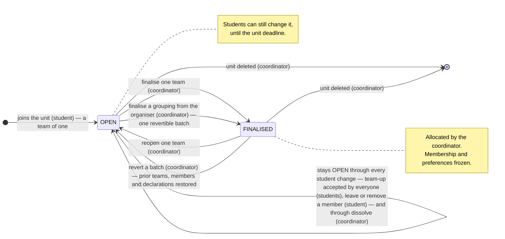
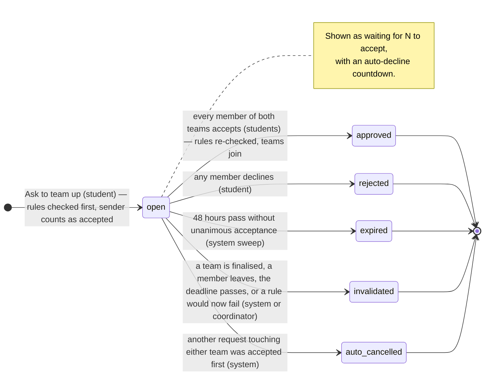

# How teams move

Two diagrams: the status of a **team** as the coordinator sees it, and the
lifecycle of a **team-up request** as a student experiences it. Both are
Mermaid, rendered by GitHub. The same two blocks are embedded in the README —
keep them in sync (`README.md`, "How teams move").

Sources of truth: `services/teamRequestService.js` (`checkRequest`,
`resolveRequest`, `sweepExpired`, `invalidateRequestsForStudent`,
`invalidateOpenForUnit`, `resolveOpenForTeam`), `services/unitService.js`
(`overrideTeam`, `finaliseTeams`, `revertFinaliseBatch`),
`services/studentPortalService.js` (`joinUnit`, `leaveTeam`, `kickMember`).

## 1. Team status

A team is in exactly one of two states. There is no student-performed
transition between them: a group records itself the moment a team-up request
is accepted (still `OPEN`), and only the coordinator writes `FINALISED`.

| State | Plain English |
|---|---|
| **OPEN** | The group exists and its students can still change it — team up, leave, remove a member — until the unit's deadline. |
| **FINALISED** | The coordinator has allocated this team. Its membership and the preferences it was built from no longer change. |

Notes:

- **The deadline is not a state.** It is derived from `units.deadline`
  (`utils/deadline.js`). Once it passes, every student transition above returns
  `403 DEADLINE_PASSED`, and the coordinator's organiser unlocks. Pushing the
  deadline out reopens formation with no other change.
- **Rules are checked at the moment of the team-up**, not at finalise: a
  request that would break a hard rule (shared tutorial, new-to-QUT cap when
  the unit sets one, max size) is refused when sent and re-checked when everyone has accepted. A
  recorded group can still be put in breach later by a rule or slot edit; the
  student sees that on My Team, the coordinator in the rules-impact preview.
- **Migration** from the approval era: `FORMING`, `SUBMITTED` → `OPEN`;
  `APPROVED` → `FINALISED` (`db/SchemaMigrator.migrateTeamStatuses`).

## 2. Team-up request lifecycle

This is the flow a student actually experiences. One student asks another
team to team up; every member of both teams accepts or declines; unanimous
acceptance joins the two teams. Storage keeps the older names — the
`proposals.state` values below — while the UI says *accepted / declined /
expired / no longer valid / withdrawn*.

| Stored state | What the student sees |
|---|---|
| `open` | "waiting" with a countdown; Accept / Decline buttons for the other side |
| `approved` | "Request accepted — you're now one group" |
| `rejected` | "Request declined" |
| `expired` | "Request expired" |
| `invalidated` | "Request no longer valid" — with the reason when it was a rule (`invalidated_reason`) |
| `auto_cancelled` | "Request withdrawn — another team-up completed first", naming who moved |
